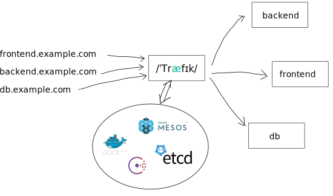

name: inverse
layout: true
class: center, middle, inverse
---
# Microservices
with


Emile Vauge
---
layout: false
class: center, middle
# DevOps


.bottom[
<i class="fa fa-twitter fa-2x"></i> [@emilevauge](http://twitter.com/emilevauge)

<i class="fa fa-github fa-2x"></i> [emilevauge/traefik](https://github.com/emilevauge/traefik)
]

---
class: center, middle
## Microservices


---
class: center, middle
# Immutable infrastructure
# Horizontal scaling

---
class: center, middle
.left-column[
### Microservices stack
]
.right-column[


]

---
class: center, middle
.left-column[
### Microservices stack
### Containers
]
.right-column[

]

---
class: center, middle
.left-column[
### Microservices stack
### Containers
### Orchestration
]
.right-column[


]

---
class: center, middle
.left-column[
### Microservices stack
### Containers
### Orchestration
### Logs
]
.right-column[


]

---
class: center, middle
.left-column[
### Microservices stack
### Containers
### Orchestration
### Logs
### Reverse proxy
]
.right-column[

]

---
class: center, middle, inverse
# Demo

---
class:  middle

## Infrastructure

```sh
docker-compose -f mesos.yml up -d
docker-compose -f infrastructure.yml up -d
```
* Configure Graylog http://localhost:9000/
* Test Mesos http://localhost:5050/
* Test Marathon http://localhost:8080/
* Test Traefik http://localhost:8081/
* Test whoami deployment

```sh
curl -X POST -H "Accept: application/json" -H "Content-Type: application/json" http://localhost:8080/v2/apps -d @whoami.json
```

## Apps

```sh
curl -X PUT -H "Accept: application/json" -H "Content-Type: application/json" http://localhost:8080/v2/groups -d @microservices.json
```

---
class: center, middle, inverse

# Merci
